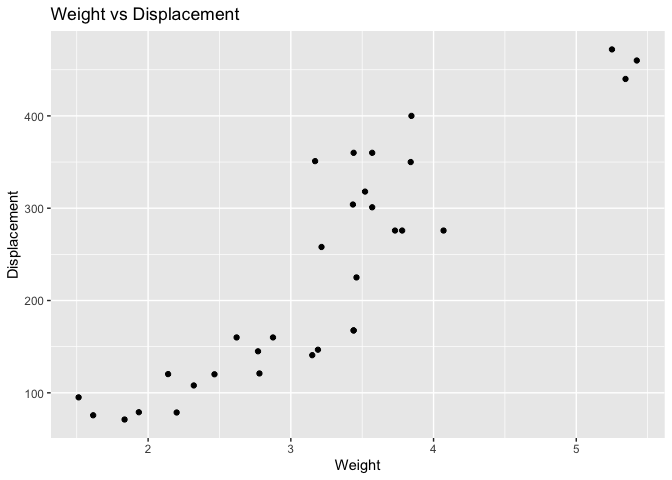
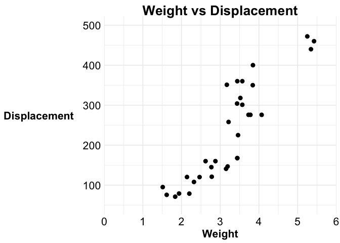
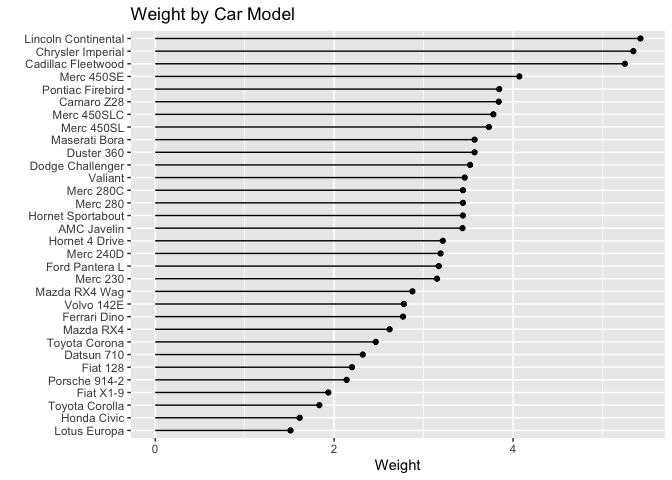
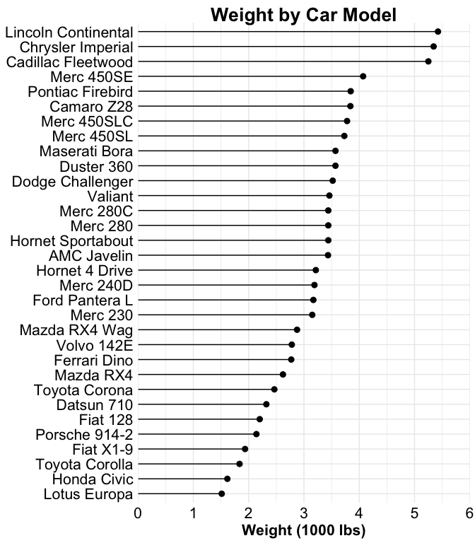

### Scatter Plot, No Theme

    ggplot(mtcars, aes(wt, disp)) + 
      geom_point() + 
      labs(x = "Weight", 
           y = "Displacement", 
           title = "Weight vs Displacement")

### Scatter Plot, theme\_sarah()

    ggplot(mtcars, aes(wt, disp)) + 
      geom_point(size = 2.5) + 
      scale_x_continuous(breaks = seq(0, 6, 1), limits = c(0, 6), 
                         expand = c(0, 0)) +
      scale_y_continuous(breaks = seq(100, 500, 100), 
                         limits = c(50, 500)) + 
      labs(x = "Weight", 
           y = "Displacement   ", 
           title = "Weight vs Displacement") + 
      theme_sarah()

### Lollipop Chart, No Theme

    ggplot(mtcars, aes(reorder(rownames(mtcars), wt), y = 0)) +
      geom_segment(aes(xend = reorder(rownames(mtcars), wt), yend = wt)) + 
      geom_point(aes(y = wt)) + 
      coord_flip() + 
      labs(y = "Weight",
           x = "", 
           title = "Weight by Car Model")

### Lollipop Chart, theme\_sarah()

    ggplot(mtcars, aes(reorder(rownames(mtcars), wt), y = 0)) +
      geom_segment(aes(xend = reorder(rownames(mtcars), wt), yend = wt)) + 
      geom_point(aes(y = wt), size =2.5) + 
      coord_flip() + 
      scale_y_continuous(breaks = seq(0, 6, 1), 
                         limits = c(0, 6), 
                         expand = c(0, 0)) + 
      labs(y = "Weight (1000 lbs)",
           x = "", 
           title = "Weight by Car Model") + 
      theme_sarah()

